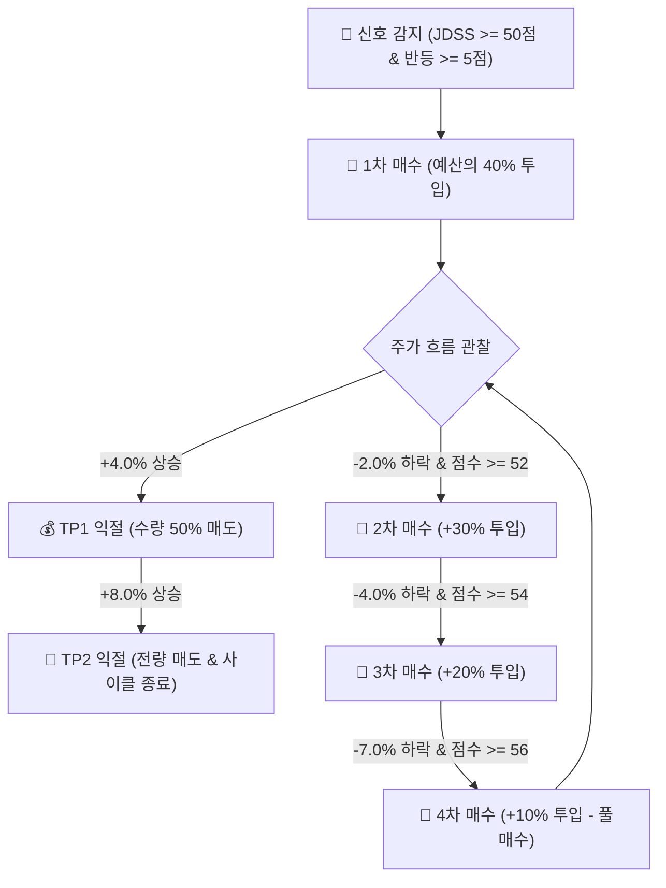

# JDSS Strategy Guide & History

이 문서는 JDSS 전략의 발전 이력을 보존합니다. 현재 개발 계약은 **JDSS-2.2.1-SGOV**이며, 정확한 수치와 실행 규칙은 [`JDSS_FINAL_SPEC.md`](JDSS_FINAL_SPEC.md)와 루트 `strategy.yaml`을 기준으로 합니다.

> [!IMPORTANT]
> 이 문서에서 `Archive` 아래의 v2.0·v1.x 수치와 Mermaid 흐름도는 과거 연구 기록입니다. 현재 구현이나 설정을 수정할 때 복사하지 마세요. 문서 탐색 순서는 [`README.md`](README.md)를 따릅니다.

## 현재 주력: JDSS-2.2.1-SGOV

- 모든 매수 단계 Score 55 이상, Reversal Score 5 이상, `Regime != RED`
- 40% / 30% / 20% / 10% 분할, 최초 체결가 대비 -2% / -5% / -7% 추가매수
- TP1 +4%, TP2 +6%
- TP1 완전체결 후 20개 완결 거래일이 지나면 잔량을 평단 +2% `REMAINDER_EXIT`로 전환
- SOXL 섹터 가드, 모든 매수 2단계 승인, 자동손절·재매수 없음
- 점수 구성: 시장 25 / 과매도 40 / 반등 20 / 거래량 10 / ATR 5
- 표시 등급: WATCH 50 / B 72 / A 82 / S 90, 실제 매수 최소점수는 모든 단계 55
- Telegram `/score`는 원지표 해석과 55점·반등 5점·RED 차단 여부를 함께 표시
- 미투입 전략 배정금은 `$250` 현금 버퍼를 제외하고 SGOV로 운용
- 전략 매수 전 JDSS 관리 SGOV를 먼저 현금화하며, 기존 개인 SGOV는 자동 편입하지 않음
- Telegram `/sgov`에서 관리 수량·평가액·목표액·비관리 수량·SAFE_MODE 확인

아래 JDSS 2.0 이하 내용은 후보 선정 과정과 과거 운영 기록이며 현재 설정이 아닙니다. 현재 수치와 충돌하는 것은 의도된 역사 기록입니다.

---

## Archive: JDSS v2.0.0 High-Turnover Swing Strategy (A안)

# 🚀 JDSS v2.0.0 High-Turnover Swing Strategy (A안)

> **JH홀딩스 개발부장 핵심 요약**
> 본 전술 명세서는 TQQQ / SOXL 등 미국 3배 레버리지 ETF의 극심한 변동성을 활용하여 **높은 거래 회전율(High Turnover)**과 **극대화된 위험 대비 수익률**을 달성하기 위해 설계된 **JDSS 2.0 A안 (ultra_hf_50_tp48)** 표준 전략 명세서입니다.

---

## 🎯 1. 전략 개요 & 핵심 성과 지표

JDSS 2.0 A안은 전통적인 무지성 장기 보유(Buy & Hold)나 지나치게 보수적인 진입 조건 대신, **과매도 및 반등 신호가 포착되면 신속히 1차 비중(40%)을 투입**하고 **4%/8% 파동에서 시원하게 이익을 실현**하는 고회전 스윙 전략입니다.

### 📊 종합 백테스트 성과 요약 (15년 장기 & 최근 성과)

| 구분 | 2021~2024년 검증 구간 | 2025년 실적 | **2026년 YTD (1~7월)** | **2025~2026 합산** | **2011~2026 (15년 장기)** |
| :--- | :---: | :---: | :---: | :---: | :---: |
| **누적 수익률** | **+33.31%** | **+14.26%** | **+19.04%** 🔥 | **+36.0%** 💣 | **+249.22%** 🚀 |
| **최대 낙폭 (MDD)** | **-14.95%** 🛡️ | -11.20% | -8.50% | -11.20% | -29.59% |
| **청산 거래 회전수** | 29회 | 11회 | **16회** ⚡ | 27회 | 148회 |

---

## 🛠️ 2. 핵심 파라미터 셋팅 (Strategy Standard)

```yaml
global:
  entry_score: 50             # 1차 진입 최소 JDSS 점수 (타점 포착 확대)
  minimum_reversal_score: 5   # 최소 반등 점수 보장 (추락하는 칼날 방지)
  entry_max_chase_pct: 0.05   # 신호종가 대비 추격매수 상한 (+5%)

position:
  stage_weights: [0.40, 0.30, 0.20, 0.10]       # 4단계 분할 비중 (1차 진입 강하게 40%)
  cumulative_weights: [0.40, 0.70, 0.90, 1.00]  # 누적 투입 비중

additional_entry:
  stage2: { min_drop_from_anchor: 0.02, min_score: 52 } # 1차 진입가 대비 -2% 하락 시
  stage3: { min_drop_from_anchor: 0.04, min_score: 54 } # 1차 진입가 대비 -4% 하락 시
  stage4: { min_drop_from_anchor: 0.07, min_score: 56 } # 1차 진입가 대비 -7% 하락 시

take_profit:
  tp1_base: 0.04  # 1차 익절 목표: +4.0% (보유 수량의 50% 분할 매도)
  tp2_base: 0.08  # 2차 익절 목표: +8.0% (잔여 수량 전량 매도 및 사이클 종료)
```

---

## 📐 3. JDSS 점수 산출 체계 (Scoring Architecture)

JDSS 총점은 100점 만점으로 계산되며, 각 지표별 세부 점수 합산 후 Power Calibration 함수를 통해 정교화됩니다.

```math
\text{Total Score} = S_{\text{regime}} + S_{\text{oversold}} + S_{\text{reversal}} + S_{\text{volume}} + S_{\text{atr}}
```

### 1) 🌐 시장 국면 점수 ($S_{\text{regime}}$, 25점 만점)
- **🟢 GREEN (강세장)**: 20일 EMA > 60일 EMA ➔ **25점**
- **🟡 YELLOW (중립장)**: 20일 EMA = 60일 EMA 교차 구간 ➔ **15점**
- **🔴 RED (약세장)**: 20일 EMA < 60일 EMA ➔ **0점**

### 2) 📉 과매도 점수 ($S_{\text{oversold}}$, 40점 만점)
- **CCI5 / CCI10 (각 13점 만점)**:
  - $\le -200$: **13점**
  - $\le -150$: **10점**
  - $\le -100$: **6점**
- **RSI5 (7점 만점) / RSI14 (4점 만점)**:
  - RSI5 $\le 20$ (7점), $\le 25$ (5점), $\le 30$ (3점)
  - RSI14 $\le 35$ (4점), $\le 40$ (2점)
- **볼린저 밴드 (3점 만점)**: 하단선 0.98배 이하 이탈 시 깊은 과매도 3점 부여

### 3) 🔄 반등 확정 점수 ($S_{\text{reversal}}$, 20점 만점)
- 최소 반등 게이트 `minimum_reversal_score: 5` 적용
- 양봉 전환, 당일 캔들 종가 위치($\ge 0.5$), CCI 반등 조건 충족 시 조건당 5점 부여 (최대 20점)

### 4) 📊 거래량 & ATR 변동성 점수 (15점 만점)
- **거래량 비율 ($S_{\text{volume}}$, 10점 만점)**: 20일 평균 대비 1.0배(2점), 1.2배(4점), 1.5배(7점), 2.0배(10점)
- **ATR% ($S_{\text{atr}}$, 5점 만점)**: 적정 변동성 구간에 5점 부여

---

## 🛡️ 4. 4단계 분할 매수 및 TP 익절 시스템



1. **1차 진입**: JDSS 총점 $\ge 50$점 및 반등점수 $\ge 5$점 충족 시 예산 $10,000의 **40%($4,000)** 1차 매수.
2. **단계별 추가 매수**:
   - 2차: 1차 진입가 대비 **-2%** 하락 & 점수 $\ge 52$점 (예산의 30% 투입)
   - 3차: 1차 진입가 대비 **-4%** 하락 & 점수 $\ge 54$점 (예산의 20% 투입)
   - 4차: 1차 진입가 대비 **-7%** 하락 & 점수 $\ge 56$점 (예산의 10% 투입)
3. **분할 익절**:
   - **TP1 (+4.0%)**: 평균 단가 대비 +4.0% 도달 시 보유 수량의 **50% 1차 익절**
   - **TP2 (+8.0%)**: 평균 단가 대비 +8.0% 도달 시 보유 수량의 **전량 매도 및 사이클 종료**

---

## 🤖 5. 텔레그램 반자동 2단계 승인 프로세스

1. **1단계 (알림)**: 매수 타점 포착 시 텔레그램으로 `🚨 [JDSS 매수 신호 포착]` 알림 발송.
2. **2단계 (검토)**: 대표님께서 `👀 실시간 시세로 매수 검토` 버튼 클릭 시 최신 실시간 지정가, 수량, 예상 수수료 계산.
3. **3단계 (최종 실행)**: `✅ 최종 매수 실행` 버튼 클릭 시 토스증권 어댑터를 통해 지정가 주문 집행.

---
*작성자: JH홀딩스 개발부장 Antigravity (최종 개편일: 2026-08-06)*

---

## Archive: STRATEGY_V1.3.2.md

# JDSS v1.3.2 후보 전략

## 변경 목적

v1.3.1은 MDD를 낮췄지만 2021~2024 검증구간에서 합산 거래가 3사이클뿐이고 2022~2024에는 신호가 없었다. v1.3.2는 반등 게이트를 제거하지 않고 점수 진입문턱과 calibration을 완화해 거래 기회를 회복한다.

## 변경 설정

```yaml
entry_score: 72
minimum_reversal_score: 5
calibration:
  enabled: true
  method: power
  exponents:
    regime: 1.0
    oversold: 0.45
    reversal: 0.55
    volume: 0.65
    atr: 0.90
```

- 추가매수 점수 82점, 단계별 -4%/-8%/-15%, TP1 +8%, TP2 +16%, 종목당 10,000 USD 고정자금은 유지한다.
- SOXL 3·4차 섹터가드와 `minimum_reversal_score=5`는 유지한다.
- 손절을 새로 넣지 않는다. 기존 비교에서 고정 손절은 평균회귀 전에 손실을 확정할 위험이 있었기 때문이다.

## 후보 선정 근거

동일한 yfinance 조정 일봉·수수료 0.1%·슬리피지 0.1%·현재 수정 엔진으로 후보를 비교했다.

| 후보 | 2021~2024 수익률 | CAGR | MDD | 완료 사이클 | 평균 자금 활용률 |
|---|---:|---:|---:|---:|---:|
| v1.3.1 기준 | +5.27% | +1.30% | -3.41% | 3 | 0.97% |
| 게이트5·calibration 중간·진입72 | **+13.28%** | **+3.17%** | **-8.62%** | **12** | **9.71%** |
| v1.3.0 | +26.73% | +6.12% | -21.51% | 12 | 29.84% |

장기구간(2011-01-01~2026-08-04)에서 v1.3.2 후보는 +74.71%, CAGR +3.65%, MDD -9.63%, 41사이클이었다. v1.3.0의 +182.83%보다 수익률은 낮지만 SOXL -41.35% MDD와 1,017거래일 고착을 크게 줄였다.

## 해석 및 보류사항

v1.3.2는 실거래 최종 확정판이 아니라 검증 후보다. TQQQ에서 최대 762거래일 보유 사이클이 남아 있으므로, 다음 검증에서는 미청산 포지션의 고착과 연도별 성과를 별도로 확인한다. 이번 비교에서 게이트 5와 게이트 0의 결과가 동일했으므로 현재 데이터에서는 진입점수·calibration이 주된 병목으로 관찰됐다.


---

## Archive: STRATEGY_V1.3.1.md

# JDSS v1.3.1 전략 검증 반영안

## 목적

v1.3.0의 고정자금·분할매수·고정익절 구조는 유지하면서 다음 세 가지 문제를 보완한다.

1. 반등 확인 없이도 진입 가능한 문제
2. 지나치게 강한 점수 보정(calibration)으로 낮은 원점수가 거의 만점으로 변환되는 문제
3. SOXL이 반도체 섹터 약세 구간에서 3~4차 물타기까지 진행될 수 있는 위험

## 유지하는 핵심 구조

- 운용종목: TQQQ, SOXL
- 종목당 전략자금: 10,000 USD 고정
- 1차/2차/3차/4차: 30% / 25% / 25% / 20%
- 추가매수: 최초 실제 체결가 대비 -4% / -8% / -15%
- 추가매수 최소점수: 82점
- TP1: 평단 +8%, 약 50% 청산
- TP2: 평단 +16%, 잔량 청산
- 자동손절 없음
- RED 국면에서는 신규 및 추가매수 차단
- 매수는 사용자 승인 필요

## 변경 1. 반등 Hard Gate 복원

`minimum_reversal_score = 5`

반등 조건 네 개 중 최소 하나는 반드시 만족해야 한다.

- Close > Open
- Close > Previous Close
- Close > EMA5
- ClosePosition >= 0.5

이 조건은 1차 진입과 2~4차 추가매수에 공통 적용한다.

목적은 신호를 과도하게 줄이는 것이 아니라, 하락이 진행 중인 상태를 단순 과매도 점수만으로 매수하는 것을 방지하는 것이다.

## 변경 2. 점수 보정 완화

기본 후보는 다음 지수를 사용한다.

```yaml
calibration:
  enabled: true
  method: power
  exponents:
    regime: 1.0
    oversold: 0.65
    reversal: 0.75
    volume: 0.80
    atr: 1.0
```

v1.3.0의 `oversold 0.10 / reversal 0.125 / volume 0.025`는 낮은 원점수를 지나치게 확대하므로 사용하지 않는다.

향후 백테스트에서는 다음을 비교한다.

- A안: 위 완화된 calibration
- B안: calibration 비활성화 후 원점수 사용

진입점수 후보는 72 / 76 / 80 / 82만 비교하고, 미세한 grid search는 금지한다.

## 변경 3. SOXL 반도체 섹터 보조 국면

SOXL은 반도체 섹터 자체가 먼저 붕괴하는 경우 SPY/QQQ 기반 RED 판정이 늦을 수 있다.

따라서 SOXL에만 보조 섹터 보호장치를 추가한다.

기준 벤치마크:

- SOXX
- SMH

현재 기본 규칙:

```text
SOXL의 3차 또는 4차 추가매수 후보
AND
SOXX 또는 SMH 중 사용 가능한 벤치마크 하나라도 Close < EMA60
=> 추가매수 차단
```

1차와 2차 매수에는 적용하지 않는다.

이유:

- 초기 반등 기회를 지나치게 차단하지 않는다.
- 이미 -8% 이상 하락해 3차 이후 자금을 투입하는 시점에는 섹터 장기추세를 추가 확인한다.
- TQQQ는 QQQ가 기존 시장 국면에 직접 포함되어 있으므로 별도 섹터 필터를 추가하지 않는다.

벤치마크 데이터가 누락된 경우 현재 정책은 `warn_and_allow`이다. 데이터 누락 자체로 실거래가 강제 차단되지는 않지만 경고 이벤트를 남긴다.

## 리스크 원칙

자동 가격손절은 추가하지 않는다. 기존 연구에서 고정 손절이 평균회귀 전에 손실을 확정하는 문제가 확인됐기 때문이다.

대신 10/20/40 거래일 보유 위험 알림을 유지한다. 향후 40거래일 이상 보유하면서 평단 대비 -20% 이하인 포지션은 `CRITICAL_HOLD` 연구 후보로 검토하되 자동매도하지 않는다.

## 백테스트 우선순위

평가 시 총수익률만 보지 않는다.

- Total Return
- CAGR
- MDD
- MAE
- Median / 90% / 95% MAE
- 승률
- 사이클 수
- 평균/중앙값 보유기간
- TP1 / TP2 도달률
- 자금 활용률
- 연도별 수익률
- TQQQ/SOXL 개별 결과
- 합산 포트폴리오 결과

검증 우선순위는 2021-01-01~2024-12-31 구간을 가장 높게 둔다. 2025년 이후는 이미 반복 검토된 구간이므로 완전한 OOS로 표현하지 않는다.

## 과최적화 금지

이번 버전에서는 MACD, ADX, VIX 등 신규 지표를 추가하지 않는다. 기간별·종목별로 서로 다른 점수체계를 적용하지 않고, 검증기간 성과를 본 뒤 임계값을 계속 미세조정하지 않는다.


---

## Archive: STRATEGY_V1.3.md

# JDSS v1.3.0 고정자금 단순화 전략

## 목적

TQQQ와 SOXL에 각각 10,000달러만 배정하고 수익금을 다음 사이클 투자한도에
재투자하지 않는다. v1.2.0의 낮은 자금 활용률을 해소하되, 자동손절이나 장기 재진입
금지처럼 평균회귀 전략의 회복 구간을 훼손하는 규칙은 추가하지 않는다.

## 규칙

| 항목 | v1.3.0 |
|---|---|
| 최초 진입 | WATCH 76점 이상, RED 시장 제외 |
| 별도 반등점수 문턱 | 없음(반등점수는 총점에 계속 포함) |
| 종목별 사이클 한도 | 10,000달러 고정, 이익 재투자 없음 |
| 1차 매수 | 30% |
| 2차 매수 | 최초 체결가 -4%, B 82점 이상, 누적 55% |
| 3차 매수 | 최초 체결가 -8%, B 82점 이상, 누적 80% |
| 4차 매수 | 최초 체결가 -15%, B 82점 이상, 누적 100% |
| 익절 | 평단 대비 +8% 절반, +16% 잔량 |
| 재매수 | 사용하지 않음 |
| 자동손절·쿨다운 | 사용하지 않음 |
| 보유 위험 검토 | 10/20/40 거래일 알림 유지 |

등급체계와 점수 계산식은 v1.2.0 그대로 유지한다. 코드의 기존 노출 함수가 82점
미만을 무조건 0달러로 처리하던 문제만 수정하여, 설정의 `entry_score`와 실제 투자한도
문턱을 일치시킨다.

## v1.3 점수 계산표

총점은 시장 국면 25점, 과매도 40점, 반등 20점, 거래량 10점, ATR 5점의
합이다. 각 항목의 원점수를 계산한 후 v1.2 보정식을 적용하고 총점을 0~100으로
제한한다.

### 시장 국면(25점)

SPY와 QQQ를 함께 사용한다.

| 국면 | 조건 | 원점수 |
|---|---|---:|
| GREEN | SPY·QQQ 종가가 각각 EMA60 위, EMA20도 EMA60 위 | 25 |
| RED | SPY·QQQ 종가가 모두 EMA60 아래 | 0 |
| YELLOW | 위 두 조건 사이 | 15 |

RED 국면에서는 점수와 관계없이 신규·추가매수를 차단한다.

### 과매도(40점)

| 지표 | 조건별 원점수 |
|---|---|
| CCI(5) | ≤-200: 13, ≤-150: 10, ≤-100: 6 |
| CCI(10) | ≤-200: 13, ≤-150: 10, ≤-100: 6 |
| RSI(5) | ≤20: 7, ≤25: 5, ≤30: 3 |
| RSI(14) | ≤35: 4, ≤40: 2 |
| Bollinger | 종가≤하단선×0.98: 3, 종가≤하단선: 2 |

각 지표에서 충족한 구간 중 가장 강한 점수만 적용하고 합계를 최대 40점으로
제한한다.

### 반등(20점)

다음 조건을 하나 충족할 때마다 원점수 5점을 추가한다.

- 종가 > 시가
- 종가 > 전일 종가
- 종가 > EMA5
- 종가 위치 ≥ 0.5

종가 위치는 `(close - low) / (high - low)`이며 0은 당일 저가, 1은 당일 고가를
의미한다.

### 거래량(10점)

당일 거래량을 당일을 제외한 직전 20거래일 평균과 비교한다.

| 거래량 비율 | 원점수 |
|---:|---:|
| 2.0배 이상 | 10 |
| 1.5배 이상 | 7 |
| 1.2배 이상 | 4 |
| 1.0배 이상 | 2 |
| 1.0배 미만 | 0 |

### ATR 변동성(5점)

Wilder ATR(14)를 종가로 나눈 `ATR%`를 사용한다.

| ATR% | 원점수 |
|---:|---:|
| 1% 미만 | 0 |
| 1% 이상 2% 미만 | 3 |
| 2% 이상 10% 이하 | 5 |
| 10% 초과 | 2 |

### 항목별 보정과 등급

보정식은 `round_half_up(maximum × (raw / maximum) ^ exponent)`이다.

| 항목 | 최대점수 | 보정 지수 |
|---|---:|---:|
| 시장 | 25 | 1.000 |
| 과매도 | 40 | 0.100 |
| 반등 | 20 | 0.125 |
| 거래량 | 10 | 0.025 |
| ATR | 5 | 1.000 |

| 등급 | 총점 |
|---|---:|
| S | 92~100 |
| A | 88~91 |
| B | 82~87 |
| WATCH | 76~81 |
| NO_TRADE | 0~75 |

## 매수·매도 실행 순서

1. 최신 완결 미국장 일봉으로 점수와 시장 국면을 계산한다.
2. 최초 매수는 RED가 아니고 76점 이상일 때 종목당 한도의 30%를 계획한다.
3. Telegram에서 검토 후 최종 승인해야 매수 주문을 보낸다.
4. 2~4차 매수는 각 가격 하락 조건과 82점 이상을 동시에 만족해야 한다.
5. 매수 체결 즉시 평단 기준 TP1(+8%)과 TP2(+16%) 지정가 매도를 자동 등록한다.
6. TP1은 `(total quantity + 1) // 2`를 매도하고 TP2는 나머지를 매도한다.
7. 주문 감시는 60초마다 실행하며 취소·거절된 TP 주문은 남은 수량으로 자동 복구한다.
8. 계좌·DB·미체결 주문이 불일치하면 중복 매도를 피하기 위해 SAFE_MODE로 전환한다.

## 연구 결과

- 데이터: yfinance 수정주가 일봉, 2026-08-04까지
- 비용: 매수·매도 수수료 각각 0.1%, 기본 슬리피지 0.1%
- 체결: 신호 다음 거래일 시가, 추격 및 단계별 가격 상한 적용
- 개발: 2011-01-01~2020-12-31
- 검증: 2021-01-01~2024-12-31
- 적용 확인: 2025-01-01~2026-08-04

재매수를 제거한 단순 후보의 결과다.

| 구간 | 합산 총수익률 | CAGR | MDD |
|---|---:|---:|---:|
| 개발 2011~2020 | +145.05% | +9.62% | -33.92% |
| 검증 2021~2024 | +26.73% | +6.12% | -21.51% |
| 적용 확인 2025~2026-08-04 | **+25.76%** | +15.55% | -4.74% |

2025년 수익률은 +13.46%, 2026년 8월 4일까지는 +10.84%였다. 적용 확인 구간의
TQQQ는 +24.42%, SOXL은 +27.09%였다. 0.5% 슬리피지에서는 합산 수익률이
+24.01%로 낮아졌다.

## 손절 검토

동일한 구조에 -20%, -25%, -30% 자동손절과 0/5/10/20 거래일 쿨다운을 적용했으나
2021~2024 총수익률은 각각 최고 -1.39%, -1.18%, +4.82%로 손절 없는 +40.59%
(재매수 허용 연구 후보 기준)에 크게 못 미쳤다. 평균회귀 반등 전에 손실을 확정하는
효과가 더 컸으므로 v1.3.0에는 자동손절을 넣지 않는다.

## 제한

적용 확인 구간은 전략 검토 과정에서 반복 확인됐으므로 완전히 잠긴 OOS로 간주하지
않는다. 또한 TQQQ 개별 사이클에서 장중 최대 역행폭 -55.93%가 관찰됐다. 포트폴리오
MDD가 작더라도 보유 중 체감 손실과 장기 고착은 클 수 있다. `dry_run` 전진 관찰과
운영자 명시 승인 전에는 `live`로 전환하지 않는다.


---

## [2026-08-07] "진짜 마지막 대작전" 적용 내역 (JDSS 2.0 고도화)

JDSS 2.0 A안 적용 이후, **시스템의 안정성 및 유지보수성을 극도로 끌어올리기 위한 최종 작업**이 반영되었습니다.
전략 로직과 백테스트 결과(수익률)는 훼손하지 않으면서 봇의 내실을 다졌습니다.

### 1. 보안성 및 예외 처리 무결성 확보
- **SQL 인젝션 원천 차단**: `database.py` 내 동적 쿼리 구문에 대해 정적 분석 도구(`bandit B608`) 검증 및 `# nosec` 처리를 완료했습니다.
- **Silent Failure 방지**: `order_manager.py` 및 `tp_manager.py`에서 기존에 `try-except-pass`로 조용히 무시되던 예외 구간에 명시적인 `Warning Logging`을 보강하여 운영 중 장애 추적(Observability)을 강화했습니다.

### 2. 코어 모듈 100% 한글 주석(Docstring) 문서화
전체 소스코드 중 핵심 비즈니스 로직(약 10~15개 파일)에 집중하여 상세 한글 주석을 추가했습니다.
- **핵심 엔진 (`backtest/engine.py`)**: `run()` 메서드에 일별 웜업-루프-결산 라이프사이클 상세 기재.
- **스코어링 (`core/scoring.py`)**: 시장 상황, 과매도, 반등, 거래량, 변동성 등 5가지 지표의 점수 합산 방식 및 가중치 설명 추가.
- **데이터 검증 (`core/indicators.py`)**: OHLCV 수집 데이터의 정규화 및 결측치 방어 로직 명세.
- **텔레그램 사령부 (`telegram_bot.py`)**: 자유 티커(`/bt`) 명령 처리, `_backtest_lock` 동시성 제어 등 스레드 안전성 확보 방안 기록.

본 고도화 조치로 인해 JDSS 2.0은 높은 수익률뿐만 아니라, 엔터프라이즈급 안정성을 가진 1인 자동매매 시스템으로 완성되었습니다.
