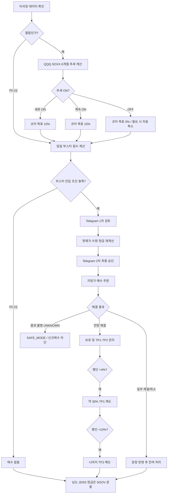
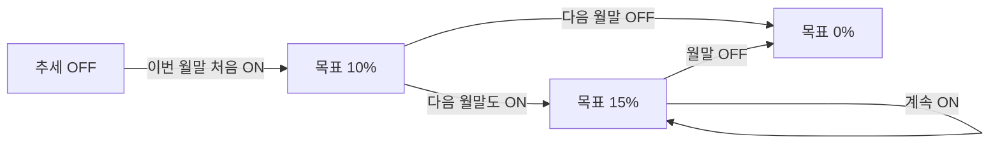
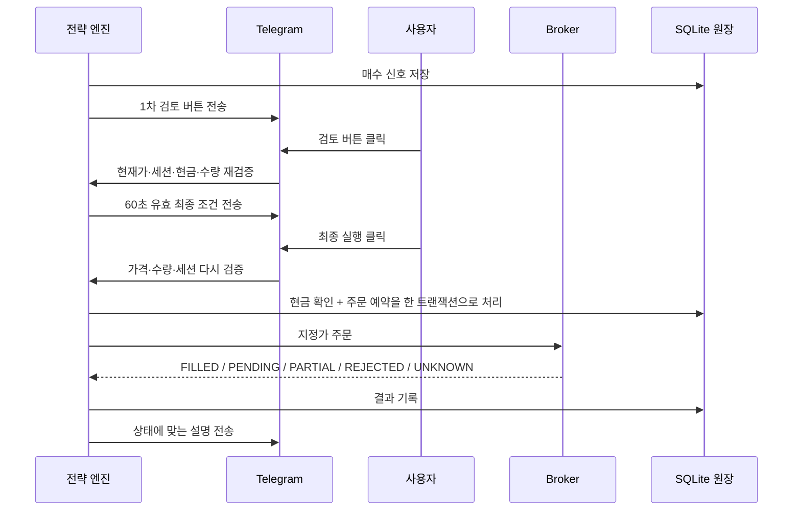
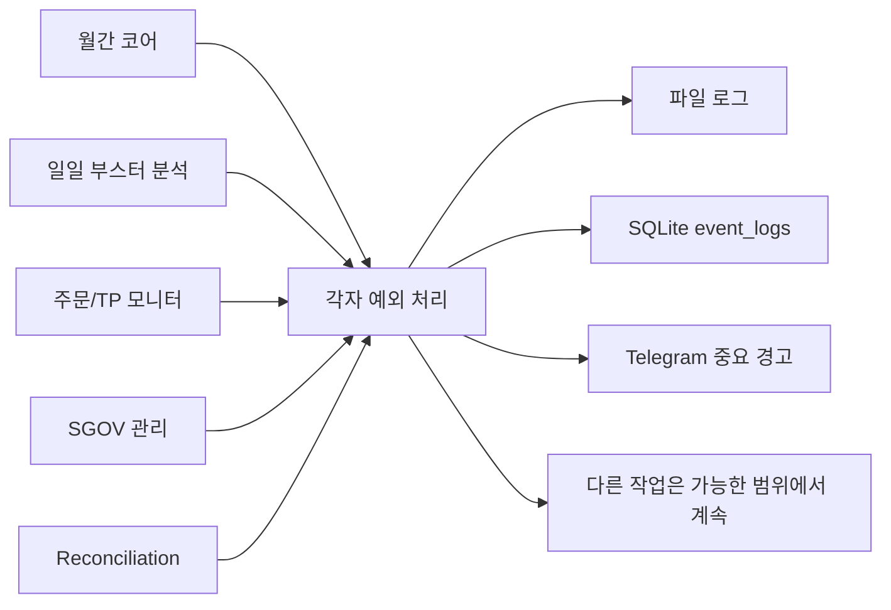

# JDSS V3.1 전략 가이드 — 처음 보는 사람도 이해하는 설명서

현재 공식 전략은 **JDSS-3.1.0-TWIN-H40-S3**다. 이 문서는 전략을 처음 보는 사람도 전체 흐름을 이해할 수 있게 쉽게 설명한다. 실제 프로그램이 따라야 하는 정확한 숫자와 계약은 [`JDSS_FINAL_SPEC.md`](JDSS_FINAL_SPEC.md)와 저장소 루트의 `strategy.yaml`이 최종 기준이다.

## 1. 이 전략을 한 문장으로 설명하면

JDSS V3.1은 **상승 추세에는 조금씩 오래 따라가고(코어), 크게 눌렸을 때는 짧은 반등을 노려 추가로 매수하는(부스터) 전략**이다. 사용하지 않는 전략자금은 SGOV에 두어 놀리지 않는다.

쉽게 비유하면 다음과 같다.

- **코어(Core)**: 자동차의 기본 엔진. 시장의 큰 방향이 좋으면 계속 켜 둔다.
- **부스터(Booster)**: 추월할 때 잠깐 쓰는 터보. 가격이 많이 눌리고 반등 조건이 생길 때만 쓴다.
- **SGOV**: 당장 쓰지 않는 현금을 잠시 세워 두는 주차장.
- **SAFE_MODE**: 계기판에 이상이 생겼을 때 새로 가속하지 못하게 막는 안전모드.

전략 대상은 두 종목이다.

| 실제 매매 ETF | 방향을 판단할 때 보는 기초 ETF | 의미 |
|---|---|---|
| TQQQ | QQQ | 나스닥100 3배 레버리지 |
| SOXL | SOXX | 반도체 3배 레버리지 |

SOXL 부스터에는 반도체 시장이 너무 약할 때 무리하게 진입하지 않도록 SOXX와 SMH의 EMA60도 추가로 확인한다.

---

## 2. 전체 흐름 한눈에 보기

핵심은 **매수 신호가 떴다고 바로 주문하지 않는다는 것**이다. 프로그램이 먼저 조건을 계산하고, 사용자가 Telegram에서 검토한 뒤, 주문 직전에 가격·수량·현금을 한 번 더 계산한다.

---

## 3. 코어 전략 — 큰 상승 흐름을 따라가는 부분

### 3.1 무엇을 보는가

매월 마지막 확정 거래일의 QQQ와 SOXX 종가를 각각 최근 **6개월 이동평균**과 비교한다.

- 월말 종가가 6개월 평균보다 **높다** → 추세 ON
- 월말 종가가 6개월 평균보다 **낮거나 같다** → 추세 OFF

예를 들어 QQQ의 최근 6개월 월말 종가 평균이 500달러이고 이번 월말 종가가 515달러라면 나스닥 코어는 ON이다.

### 3.2 왜 첫 달 10%, 다음 달 15%인가

추세가 막 켜진 첫 달에는 **JDSS 관리자산의 10%**만 TQQQ 또는 SOXL 코어로 잡는다. 다음 월말에도 추세가 계속 살아 있으면 목표를 **15%**로 높인다.

즉, 한 번의 월말 신호만 보고 바로 최대 비중을 넣지 않는다.

### 3.3 코어 매수도 사용자가 승인한다

코어는 월말에 목표수량을 계산하지만 매수는 자동으로 하지 않는다.

1. 프로그램이 월말 신호를 만든다.
2. Telegram으로 “코어 매수 검토” 메시지를 보낸다.
3. 사용자가 검토 버튼을 누르면 현재 가격을 다시 읽는다.
4. 신호 당시 계획수량과 현재 목표 잔여수량을 비교한다.
5. **둘 중 더 작은 수량**만 최종 승인 대상으로 잡는다.
6. 사용자가 최종 실행 버튼을 눌러야 주문한다.

가격이 내려갔다고 해서 신호 당시보다 더 많은 주식을 사는 것을 막고, 그 사이 일부 수량이 이미 채워졌다면 중복매수도 막는다.

### 3.4 코어 매도는 왜 자동인가

월말 추세가 OFF가 되거나 목표비중이 내려가면 이는 **위험을 줄이는 행동**이다. 그래서 코어 축소 매도는 자동으로 실행한다.

다만 자동매도가 일부만 체결되고 취소되거나 주문 결과를 확실히 알 수 없으면, 프로그램은 “대충 팔렸겠지”라고 가정하지 않는다. **SAFE_MODE로 전환하고 신규매수를 막은 뒤 운영자에게 확인을 요구한다.**

---

## 4. 부스터 전략 — 많이 눌렸을 때 반등을 노리는 부분

코어가 큰 흐름을 따라가는 전략이라면, 부스터는 단기적으로 많이 눌린 구간에서 반등 가능성을 점수로 판단한다.

### 4.1 점수는 100점 만점

부스터는 다음 다섯 묶음을 합쳐 100점으로 계산한다.

| 항목 | 최대점수 | 쉽게 말하면 |
|---|---:|---|
| 시장 국면 | 25 | 전체 시장 분위기가 좋은가 |
| 과매도 | 40 | 가격이 단기적으로 너무 많이 눌렸는가 |
| 반등 | 20 | 실제로 되돌림 움직임이 시작됐는가 |
| 거래량 | 10 | 움직임을 뒷받침하는 거래가 있는가 |
| ATR 변동성 | 5 | 너무 조용하거나 지나치게 비정상적이지 않은가 |

현재 기본 진입 문턱은 **총점 55점 이상 + 반등점수 5점 이상 + RED 시장이 아님**이다.

### 4.2 사용 지표를 쉽게 이해하기

- **CCI 5 / 10**: 최근 가격이 평소 흐름에서 얼마나 멀리 벗어났는지 본다. 크게 낮으면 과매도 신호로 활용한다.
- **RSI 5 / 14**: 최근 상승일과 하락일의 힘을 비교한다. 낮을수록 단기 매도 압력이 강했다는 뜻이다.
- **볼린저밴드 하단**: 가격이 평소 변동 범위의 아래쪽까지 밀렸는지 본다.
- **EMA 5 / 20 / 60**: 매우 짧은 흐름, 중간 흐름, 조금 긴 흐름을 비교한다.
- **거래량 비율**: 평소보다 거래가 얼마나 많이 붙었는지 본다.
- **ATR**: 하루 가격변동 폭이 평소 어느 정도인지 본다.
- **종가 위치**: 하루 중 저가 근처에서 끝났는지, 고가 쪽으로 회복했는지 본다.

중요한 점은 **“싸 보인다”만으로 사지 않는 것**이다. 많이 눌렸는지와 함께 실제 반등 움직임이 최소한 확인돼야 한다.

### 4.3 분할매수는 3단계

종목 하나의 부스터 자금 상한은 `$8,000`이다. 하지만 현재 S3 구조에서는 정상 한 사이클에 상한 전부를 쓰지 않고 최대 90%까지만 쓴다.

| 단계 | 조건 | 누적 목표 | `$8,000` 기준 누적 |
|---|---|---:|---:|
| 1차 | 최초 진입조건 충족 | 40% | `$3,200` |
| 2차 | 최초 체결가 대비 -2% + 조건 유지 | 70% | `$5,600` |
| 3차 | 최초 체결가 대비 -5% + 조건 유지 | 90% | `$7,200` |

따라서 `H40`의 40%는 **종목별 최대 자금 상한**을 뜻하고, S3의 실제 정상 최대 신규투입은 총 전략자금 `$20,000`의 36%인 `$7,200`이다.

### 4.4 SOXL은 한 번 더 방어한다

SOXL은 반도체 업종 자체가 약한 상황에서 레버리지 손실이 커질 수 있다. 그래서 설정된 단계에서는 SOXX·SMH의 EMA60을 추가로 본다.

현재 정책은 데이터가 일부 없으면 이벤트 로그에 경고를 남기고 **사용 가능한 벤치마크로 판단**한다. 모든 섹터 데이터가 없을 때의 정책은 전략 계약의 일부이므로 임의로 바꾸지 않고 별도 연구 대상으로 관리한다.

---

## 5. 익절 — 언제 파는가

부스터 매수가 체결되면 평균매수가격을 기준으로 TP1과 TP2를 만든다.

- **TP1: 평단 +4%** → 약 30% 매도
- **TP2: 평단 +10%** → 나머지 매도

예를 들어 평균매수가가 100달러이고 10주를 들고 있다면 개념적으로 다음처럼 움직인다.

- 104달러 부근: 약 3주 매도
- 110달러 부근: 남은 약 7주 매도

실제 정수주 반올림에 따라 수량은 달라질 수 있다.

현재 전략은 다음을 사용하지 않는다.

- 자동 손절: **OFF**
- TP1 뒤 며칠이 지나면 강제로 잔량을 파는 규칙: **OFF**
- TP1 뒤 다시 떨어졌을 때 재매수: **OFF**

이 선택은 과거 연구 결과를 기준으로 단순성과 성과를 함께 고려해 정한 것이다. 무손절은 큰 미실현손실과 장기 보유 위험이 있다는 점을 반드시 이해해야 한다.

---

## 6. SGOV — 남는 돈은 어떻게 하는가

JDSS가 관리하는 현금 중 바로 쓸 필요가 없는 부분은 SGOV로 운용한다. 다만 항상 `$250`의 현금 버퍼는 남긴다.

새 매수에 현금이 부족하면 프로그램은 **JDSS가 관리하는 SGOV만** 먼저 현금화한다. 개인이 따로 가지고 있던 SGOV는 자동으로 팔지 않는다.

또한 전체 Toss 계좌의 개인 현금도 JDSS 돈으로 보지 않는다. JDSS는 처음 배정된 `$20,000`과 그 이후 JDSS 주문에서 생긴 손익만 자체 원장으로 추적한다.

### 같은 계좌에서 개인 TQQQ/SOXL은 왜 안 되는가

브로커는 같은 계좌의 동일 종목을 “JDSS 물량”과 “개인 물량”으로 따로 표시하지 않고 합쳐서 보여준다. 그래서 개인 TQQQ나 SOXL을 같은 계좌에 섞으면 프로그램이 어느 수량이 자기 것인지 증명할 수 없다.

이 경우 Reconciliation은 정상으로 추정하지 않고 SAFE_MODE로 전환한다.

---

## 7. 실제 매수 승인 흐름

왜 두 번 승인하느냐면, 신호를 계산한 순간과 실제 버튼을 누르는 순간 사이에 가격이 크게 달라질 수 있기 때문이다.

---

## 8. 주문 결과별 행동

| 상황 | 프로그램 행동 | 사용자가 보는 의미 |
|---|---|---|
| FILLED | 체결 원장 반영, 다음 관리 단계 진행 | 정상 체결 완료 |
| PENDING | 주문 모니터가 계속 조회 | 아직 체결 완료 아님 |
| PARTIAL_FILLED | 체결된 수량만 반영 | 잔여수량 계속 확인 |
| 코어 BUY가 취소/거절 | 유효시간 안이면 동일 신호 재승인 가능 | `/signal`에서 다시 확인 |
| 코어 SELL 일부만 체결 후 종료 | SAFE_MODE | 위험축소가 끝나지 않았으므로 확인 필요 |
| UNKNOWN | 성공·실패를 추측하지 않음, SAFE_MODE | 중복주문 방지를 위해 사람이 확인 |
| DB와 Broker 수량 불일치 | Reconciliation SAFE_MODE | 신규매수 차단 |
| SGOV 원장 불일치 | SGOV SAFE_MODE | 새 전략 매수 차단 |

SAFE_MODE의 철학은 단순하다. **모르면 거래하지 않는다.**

---

## 9. 서버가 재시작되면 어떻게 되는가

프로그램은 SQLite DB를 기준으로 상태를 복구한다.

1. 코어·부스터·JDSS SGOV 수량을 원장에서 읽는다.
2. 과거 모든 체결과 수수료를 다시 계산해 managed cash를 복원한다.
3. 체결이 0이라고 명확히 증명되는 DRY 미체결 주문만 다시 메모리 브로커에 올린다.
4. `UNKNOWN`이나 재시작 시점 `PARTIAL_FILLED` 주문은 억지로 복원하지 않는다.
5. Broker와 DB를 Reconciliation으로 다시 비교한다.
6. 불일치가 있으면 SAFE_MODE로 시작하고 Telegram에 경고한다.

즉, 서버가 꺼졌다 켜졌다고 과거 손익을 잊거나 주문번호를 처음부터 다시 쓰지 않는다.

---

## 10. 오류가 하나 나면 전체 시스템이 멈추는가

아니다. 운영 안전 레이어에서는 주요 작업을 분리한다.

예를 들어 Yahoo 데이터 오류 때문에 월간 코어 계산이 실패해도 그 한 번의 오류 때문에 TP 주문 확인이나 계좌 정합성 점검까지 같이 멈추지 않도록 설계한다.

중요 오류는 다음 세 곳에 남긴다.

- 서버 로그 파일: 상세 traceback 포함, 10MB 단위 회전보관
- SQLite `event_logs`: `/errors`에서 확인할 운영 이벤트
- Telegram: 즉시 알아야 할 자동운영 오류와 SAFE_MODE 경고

같은 자동오류가 계속 반복될 때 Telegram이 도배되지 않도록 동일 유형 알림은 일정 시간 묶어서 보낸다.

---

## 11. 백테스트와 실제 프로그램은 얼마나 같은가

이 부분은 세 단계를 구분해서 이해하면 된다.

### A. 연구 백테스트

여러 전략 후보를 비교해 어떤 숫자를 쓸지 결정한 단계다.

### B. production 백테스트

채택한 V3.1을 **정식 production 전략 계산 코드**로 다시 돌린 단계다. 연구 최종 후보와 production 엔진의 핵심 수치가 정확히 일치했다.

| 지표 | V3.0 | V3.1 production |
|---|---:|---:|
| 누적수익 | +678.07% | **+1372.96%** |
| CAGR | 14.05% | **18.81%** |
| MDD | -28.29% | **-26.04%** |
| Sharpe | 0.835 | **0.940** |
| Sortino | 1.004 | **1.197** |

자세한 재현정보는 [`BACKTEST_REPORT.md`](BACKTEST_REPORT.md)를 본다.

### C. 실제 운영 dry-run

실제 봇은 production 전략 계산을 쓰지만 현실에는 백테스트가 완벽하게 표현하지 못하는 일이 있다.

- 사용자가 Telegram을 몇 분 뒤에 누름
- 지정가가 미체결됨
- 일부만 체결됨
- Yahoo 데이터가 잠시 안 들어옴
- Broker API 응답이 끊김
- 서버가 주문 도중 재시작됨
- SGOV를 먼저 팔아야 함

따라서 **“production 백테스트가 같음”과 “실제 모든 체결이 백테스트와 같음”은 같은 말이 아니다.** 이번 운영 점검은 그 차이 때문에 생길 수 있는 사고를 막는 코드와 fault-injection 테스트를 강화하는 작업이다.

---

## 12. 왜 이 전략을 V3.1로 채택했는가

V3.0 이후 다음 항목을 한 번에 뒤섞지 않고 하나씩 비교했다.

- 추세기간 10개월 → 6개월
- 코어 15% 즉시 → 10% 후 15%
- 부스터 크기 확대
- 시장 필터 추가 여부
- TP2 6/8/10%
- TP1 매도비율
- 재매수
- 4차 추가매수
- TP1 이후 시간청산

그 결과 V3.1은 단순히 수익만 높인 것이 아니라 MDD와 위험조정 지표도 함께 개선됐다.

### 연구에서 제거한 후보

- 6M+10M 이중 확인, 6M+3M slope: 단순 6M보다 열위
- QQQ EMA60 / GREEN-only 부스터 필터: 수익 감소 대비 MDD 개선 없음
- Score≥92에서만 45/50% 확대: 실제 노출 변화 없음
- 부스터 45~50%: 위험조정 성과 개선이 거의 포화
- TP2 +8%: +6%와 +10% 사이에서 우월하지 않음
- TP1 이후 20/40거래일 강제 잔량청산: 제한 없음보다 열위
- 4차 추가매수: CAGR 개선은 작고 MDD·복잡도 증가
- Rebuy ON: 장기 전체에서 체결 표본이 매우 적고 개선폭이 미미

---

## 13. 이 전략의 약점도 알아야 한다

JDSS V3.1은 완벽한 전략이 아니다.

1. **TQQQ·SOXL은 3배 레버리지 ETF다.** 큰 하락장에서 손실이 빠르게 커질 수 있다.
2. **자동 손절이 없다.** 잘못 잡히면 오랫동안 물릴 수 있다.
3. **백테스트는 과거다.** 미래 시장이 같은 방식으로 움직인다는 보장은 없다.
4. **실제 체결은 다르다.** 호가, 지연, API 장애, 승인시간 때문에 백테스트보다 나빠질 수 있다.
5. **같은 계좌의 개인 TQQQ/SOXL 혼합은 지원하지 않는다.** 원장 소유권을 증명할 수 없기 때문이다.
6. **현재 live는 잠겨 있다.** 운영 dry-run과 실브로커 위험축소 주문 검증을 더 거친 뒤 별도 승인해야 한다.

---

## 14. 운영자가 기억할 다섯 줄

1. 코어는 **6개월 월간 추세, 첫 10% → 유지 15%**.
2. 부스터는 **55점 + 반등 5점, 40/70/90% 분할, -2/-5% 추가매수**.
3. 익절은 **+4% 약 30%, +10% 잔량**.
4. 매수는 항상 **Telegram 2단계 승인**, 이상하면 **SAFE_MODE**.
5. 백테스트 수치는 production 계산으로 재현됐지만 실제 주문 장애는 **dry-run fault-injection으로 별도 검증**한다.

---

## Archive

- V3.0.0: 10개월 코어 15%, H05 부스터, +4/+6 TP, 20일 잔량청산
- V2.2.x: SGOV 관리원장, 선현금화, 자동 승인 재개, 호가 기반 지정가와 재가격
- V2.1: TP1 후 20거래일 잔여청산
- V2.0: 점수 55, 반등 5, -2/-5/-7%, +4/+6%, SOXL 섹터 가드
- V1.x: 초기 점수·분할매수 연구. [`archive/spec_v1/`](archive/spec_v1/)과 `configs/strategy_v1.1.2.yaml`은 재현 전용이다.
