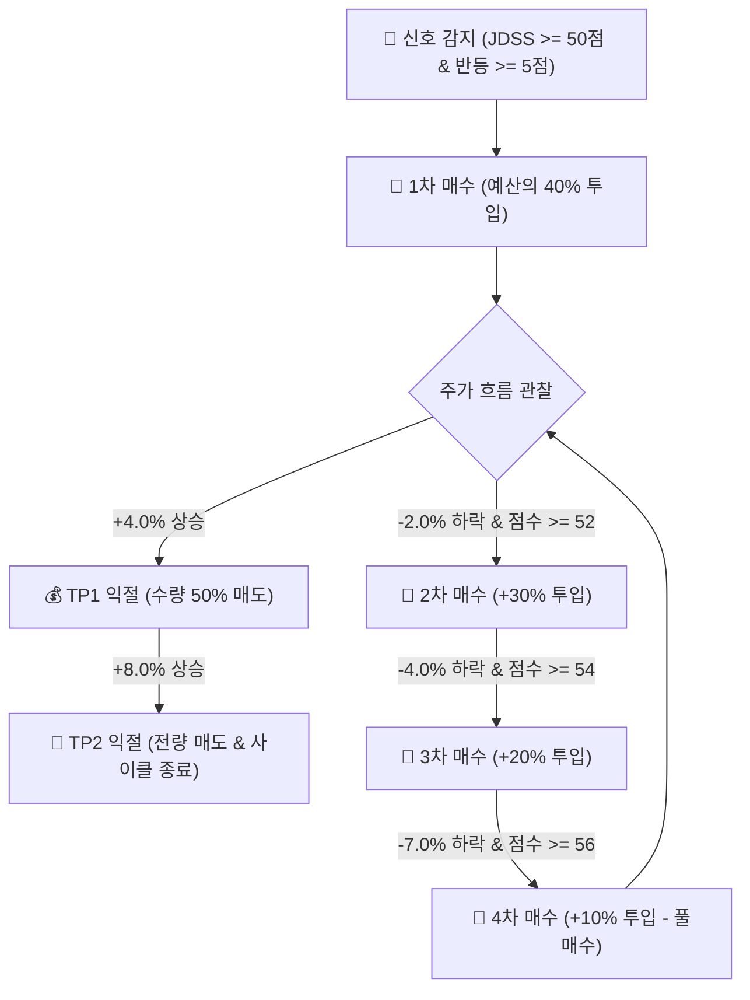

# 🚀 JDSS v2.0.0 High-Turnover Swing Strategy (A안)

> **JH홀딩스 개발부장 핵심 요약**
> 본 전술 명세서는 TQQQ / SOXL 등 미국 3배 레버리지 ETF의 극심한 변동성을 활용하여 **높은 거래 회전율(High Turnover)**과 **극대화된 위험 대비 수익률**을 달성하기 위해 설계된 **JDSS 2.0 A안 (ultra_hf_50_tp48)** 표준 전략 명세서입니다.

---

## 🎯 1. 전략 개요 & 핵심 성과 지표

JDSS 2.0 A안은 전통적인 무지성 장기 보유(Buy & Hold)나 지나치게 보수적인 진입 조건 대신, **과매도 및 반등 신호가 포착되면 신속히 1차 비중(40%)을 투입**하고 **4%/8% 파동에서 시원하게 이익을 실현**하는 고회전 스윙 전략입니다.

### 📊 종합 백테스트 성과 요약 (15년 장기 & 최근 성과)

| 구분 | 2021~2024년 검증 구간 | 2025년 실적 | **2026년 YTD (1~7월)** | **2025~2026 합산** | **2011~2026 (15년 장기)** |
| :--- | :---: | :---: | :---: | :---: | :---: |
| **누적 수익률** | **+33.31%** | **+14.26%** | **+19.04%** 🔥 | **+36.0%** 💣 | **+249.22%** 🚀 |
| **최대 낙폭 (MDD)** | **-14.95%** 🛡️ | -11.20% | -8.50% | -11.20% | -29.59% |
| **청산 거래 회전수** | 29회 | 11회 | **16회** ⚡ | 27회 | 148회 |

---

## 🛠️ 2. 핵심 파라미터 셋팅 (Strategy Standard)

```yaml
global:
  entry_score: 50             # 1차 진입 최소 JDSS 점수 (타점 포착 확대)
  minimum_reversal_score: 5   # 최소 반등 점수 보장 (추락하는 칼날 방지)
  entry_max_chase_pct: 0.05   # 신호종가 대비 추격매수 상한 (+5%)

position:
  stage_weights: [0.40, 0.30, 0.20, 0.10]       # 4단계 분할 비중 (1차 진입 강하게 40%)
  cumulative_weights: [0.40, 0.70, 0.90, 1.00]  # 누적 투입 비중

additional_entry:
  stage2: { min_drop_from_anchor: 0.02, min_score: 52 } # 1차 진입가 대비 -2% 하락 시
  stage3: { min_drop_from_anchor: 0.04, min_score: 54 } # 1차 진입가 대비 -4% 하락 시
  stage4: { min_drop_from_anchor: 0.07, min_score: 56 } # 1차 진입가 대비 -7% 하락 시

take_profit:
  tp1_base: 0.04  # 1차 익절 목표: +4.0% (보유 수량의 50% 분할 매도)
  tp2_base: 0.08  # 2차 익절 목표: +8.0% (잔여 수량 전량 매도 및 사이클 종료)
```

---

## 📐 3. JDSS 점수 산출 체계 (Scoring Architecture)

JDSS 총점은 100점 만점으로 계산되며, 각 지표별 세부 점수 합산 후 Power Calibration 함수를 통해 정교화됩니다.

```math
\text{Total Score} = S_{\text{regime}} + S_{\text{oversold}} + S_{\text{reversal}} + S_{\text{volume}} + S_{\text{atr}}
```

### 1) 🌐 시장 국면 점수 ($S_{\text{regime}}$, 25점 만점)
- **🟢 GREEN (강세장)**: 20일 EMA > 60일 EMA ➔ **25점**
- **🟡 YELLOW (중립장)**: 20일 EMA = 60일 EMA 교차 구간 ➔ **15점**
- **🔴 RED (약세장)**: 20일 EMA < 60일 EMA ➔ **0점**

### 2) 📉 과매도 점수 ($S_{\text{oversold}}$, 40점 만점)
- **CCI5 / CCI10 (각 13점 만점)**:
  - $\le -200$: **13점**
  - $\le -150$: **10점**
  - $\le -100$: **6점**
- **RSI5 (7점 만점) / RSI14 (4점 만점)**:
  - RSI5 $\le 20$ (7점), $\le 25$ (5점), $\le 30$ (3점)
  - RSI14 $\le 35$ (4점), $\le 40$ (2점)
- **볼린저 밴드 (3점 만점)**: 하단선 0.98배 이하 이탈 시 깊은 과매도 3점 부여

### 3) 🔄 반등 확정 점수 ($S_{\text{reversal}}$, 20점 만점)
- 최소 반등 게이트 `minimum_reversal_score: 5` 적용
- 양봉 전환, 당일 캔들 종가 위치($\ge 0.5$), CCI 반등 조건 충족 시 조건당 5점 부여 (최대 20점)

### 4) 📊 거래량 & ATR 변동성 점수 (15점 만점)
- **거래량 비율 ($S_{\text{volume}}$, 10점 만점)**: 20일 평균 대비 1.0배(2점), 1.2배(4점), 1.5배(7점), 2.0배(10점)
- **ATR% ($S_{\text{atr}}$, 5점 만점)**: 적정 변동성 구간에 5점 부여

---

## 🛡️ 4. 4단계 분할 매수 및 TP 익절 시스템



1. **1차 진입**: JDSS 총점 $\ge 50$점 및 반등점수 $\ge 5$점 충족 시 예산 $10,000의 **40%($4,000)** 1차 매수.
2. **단계별 추가 매수**:
   - 2차: 1차 진입가 대비 **-2%** 하락 & 점수 $\ge 52$점 (예산의 30% 투입)
   - 3차: 1차 진입가 대비 **-4%** 하락 & 점수 $\ge 54$점 (예산의 20% 투입)
   - 4차: 1차 진입가 대비 **-7%** 하락 & 점수 $\ge 56$점 (예산의 10% 투입)
3. **분할 익절**:
   - **TP1 (+4.0%)**: 평균 단가 대비 +4.0% 도달 시 보유 수량의 **50% 1차 익절**
   - **TP2 (+8.0%)**: 평균 단가 대비 +8.0% 도달 시 보유 수량의 **전량 매도 및 사이클 종료**

---

## 🤖 5. 텔레그램 반자동 2단계 승인 프로세스

1. **1단계 (알림)**: 매수 타점 포착 시 텔레그램으로 `🚨 [JDSS 매수 신호 포착]` 알림 발송.
2. **2단계 (검토)**: 대표님께서 `👀 실시간 시세로 매수 검토` 버튼 클릭 시 최신 실시간 지정가, 수량, 예상 수수료 계산.
3. **3단계 (최종 실행)**: `✅ 최종 매수 실행` 버튼 클릭 시 토스증권 어댑터를 통해 지정가 주문 집행.

---
*작성자: JH홀딩스 개발부장 Antigravity (최종 개편일: 2026-08-06)*