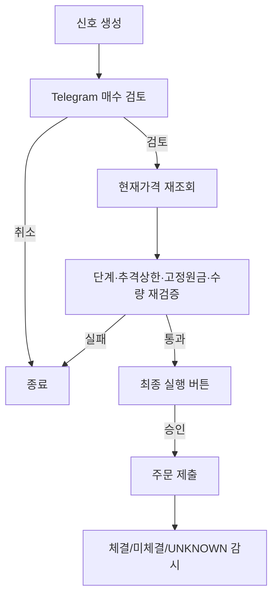

# JDSS V3.1.1 Telegram Bot 운영 가이드

Telegram 봇은 허용된 관리자 Chat ID만 사용한다. V3.1.1은 **dry-run 전용**이며 live는 잠겨 있다. 코어·부스터 BUY는 `검토 → 최종 실행` 두 번의 승인이 필요하고, 코어 위험축소 SELL과 부스터 TP SELL은 자동이다.

전략 설명은 [`STRATEGY_GUIDE.md`](STRATEGY_GUIDE.md), 정확한 계약은 [`JDSS_FINAL_SPEC.md`](JDSS_FINAL_SPEC.md)를 따른다.

## 1. 주요 명령

| 명령 | 설명 |
|---|---|
| `/dashboard`, `/d` | JDSS 고정 $50k 관리상태와 코어·부스터 요약 |
| `/portfolio`, `/pf` | 6개월 월간 코어 추세·수량과 부스터 상태 |
| `/account` | 실제 Toss 미국주식 계좌 조회 |
| `/status [종목]`, `/s` | 종목별 코어·부스터·TP 상태 |
| `/score [종목]` | 최신 완결 일봉 JDSS 점수와 진입게이트 |
| `/history [종목] [1~90]` | 최근 점수 이력 |
| `/signal` | 현재 승인 가능한 코어·부스터 BUY 신호 |
| `/backtest`, `/bt` | production V3 포트폴리오/종목 백테스트 |
| `/guide` | V3.1.1 전략과 용어 설명 카드 |
| `/order` | 현재 미체결 주문 |
| `/errors` | 최근 오류·SAFE_MODE 원인 |
| `/ping` | 봇 응답 상태 확인 |
| `/help` | 일반 메뉴와 비상명령 안내 |

**SGOV 메뉴는 V3.1.1에서 제거됐다.** 유휴원금은 USD 현금으로 유지한다. 레거시 코드에 `/sgov` 파서가 남아 있더라도 production 메뉴에는 노출하지 않으며 전략 기능은 `idle_cash.enabled=false`다.

## 2. 대시보드에서 구분해야 할 돈

Toss 계좌 전체잔고와 JDSS 자금은 다르다.

- JDSS 사이징 기준: 고정 **$50,000**
- JDSS 현재 포지션: TQQQ/SOXL 코어 + 부스터
- 개인 USD, QQQ, QQQM: JDSS와 무관
- JDSS 수익 중 고정원금을 넘는 현금: 다음 BUY에 재사용하지 않는 비관리 현금
- 개인 TQQQ/SOXL: 같은 계좌에 혼합 보유 금지

`/account`는 브로커 전체를 보여줄 수 있고, `/dashboard`·`/portfolio`는 JDSS 관점으로 해석해야 한다.

## 3. 매수 승인 흐름

### 1단계: 검토

봇은 최소한 다음 정보를 보여준다.

- TQQQ 또는 SOXL
- 코어/부스터 구분
- 점수와 반등점수
- 현재 시장 Regime
- 단계와 기준가격
- 예상 매수수량과 금액

### 2단계: 최종 실행

최종 버튼을 누르기 직전에 다시 확인한다.

- 현재 가격이 추격상한을 넘지 않았는가
- 현재 포지션 단계가 그대로인가
- 코어/부스터 목표수량을 넘지 않는가
- 현재 투자원가 + 신규 주문이 $50,000 원금상한을 넘지 않는가
- 다른 열린 BUY가 같은 현금을 예약하고 있지 않은가
- 실제 Toss USD 주문가능금액도 충분한가

하나라도 실패하면 오래된 승인으로 주문하지 않고 재검토를 요구한다.

## 4. 자동으로 처리되는 매도

다음 SELL은 위험을 줄이거나 이미 정한 익절을 실행하는 주문이므로 자동 처리한다.

- 코어 추세 OFF 매도
- 코어 목표비중 감소 매도
- TP1: 부스터 평균매수가 +4%, 약 30%
- TP2: 부스터 평균매수가 +10%, 잔량

자동손절·기간강제청산·TP1 후 재매수는 비활성화돼 있다.

## 5. `/score` 읽는 법

`/score`는 “점수가 몇 점인가”만 보는 화면이 아니다.

- CCI 5/10: 최근 가격이 평균에서 얼마나 과하게 눌렸는지
- RSI 5/14: 단기·중기 매도압력이 얼마나 강했는지
- Bollinger 하단: 가격이 정상 변동범위 아래쪽에 있는지
- EMA 5/20/60: 짧은 반등과 중기 추세
- 거래량비율: 평소보다 거래가 활발한지
- ATR 비율: 변동성이 전략에 적정한지
- 종가 위치: 하루 범위 중 어디에서 마감했는지
- Regime: 시장이 GREEN/YELLOW/RED 중 어디인지

총점 55점 이상이어도 반등점수·RED 차단·현재 단계·가격조건을 추가로 통과해야 BUY 후보가 된다.

## 6. `/portfolio` 읽는 법

코어는 월말 QQQ/SOXX의 6개월 이동평균을 기준으로 한다.

- 처음 ON: 고정 $50k의 10% → 종목당 약 $5,000
- ON 지속: 15% → 종목당 약 $7,500
- OFF: 0%

부스터 H40 cap은 종목당 $20,000이며 S3는 최대 90%까지만 사용하므로 한 사이클 최대 신규투입은 $18,000이다.

## 7. `/backtest` 주의사항

백테스트는 실제 미래수익을 보장하지 않는다. 현재 production 계약은 다음을 포함한다.

- $50,000 고정 원금
- 이익 재투자 OFF
- SGOV OFF
- 매수/매도 수수료 각 0.1%
- 슬리피지 기본 0.1%
- 코어·부스터 공유원금

V3.1.1 기준 장기 production 결과는 Total Return +414.80%, CAGR 11.07%, MDD -22.97%, Sharpe 0.839다.

## 8. SAFE_MODE가 뜨면

SAFE_MODE는 오류를 무시하고 계속 거래하지 않기 위한 안전정지다.

대표 원인:

- 실제 Toss TQQQ/SOXL 수량과 DB 기대수량 불일치
- 주문 결과 UNKNOWN
- 열린 주문에 broker order id 누락
- 재시작 때 부분체결 상태를 증명할 수 없음
- TP 원장과 포지션 수량 불일치

SAFE_MODE에서는 새 BUY를 진행하지 말고 `/errors`, `/order`, `/status`를 확인한다. 원인을 증명하지 못한 상태에서 강제로 상태를 정상화하지 않는다.

## 9. 개인자산과 같이 쓰는 규칙

같은 Toss 계좌 안에서 다음은 허용된다.

- 개인 USD 현금
- 개인 QQQ/QQQM 등 JDSS와 다른 티커

다음은 금지한다.

- 개인 TQQQ 추가매수
- 개인 SOXL 추가매수

TQQQ/SOXL은 JDSS 전용 티커로 둬야 Reconciliation이 안전하게 작동한다.

## 10. 운영자가 기억할 것

1. BUY는 항상 두 번 확인한다.
2. $50,000은 JDSS 위험원금 한도이지 Toss 전체잔고가 아니다.
3. JDSS 수익과 월급이 계좌에 있어도 봇이 자동으로 재투자하지 않는다.
4. SGOV는 사용하지 않는다.
5. SAFE_MODE를 우회하지 않는다.
6. 별도 승인 전 live 잠금은 해제하지 않는다.
