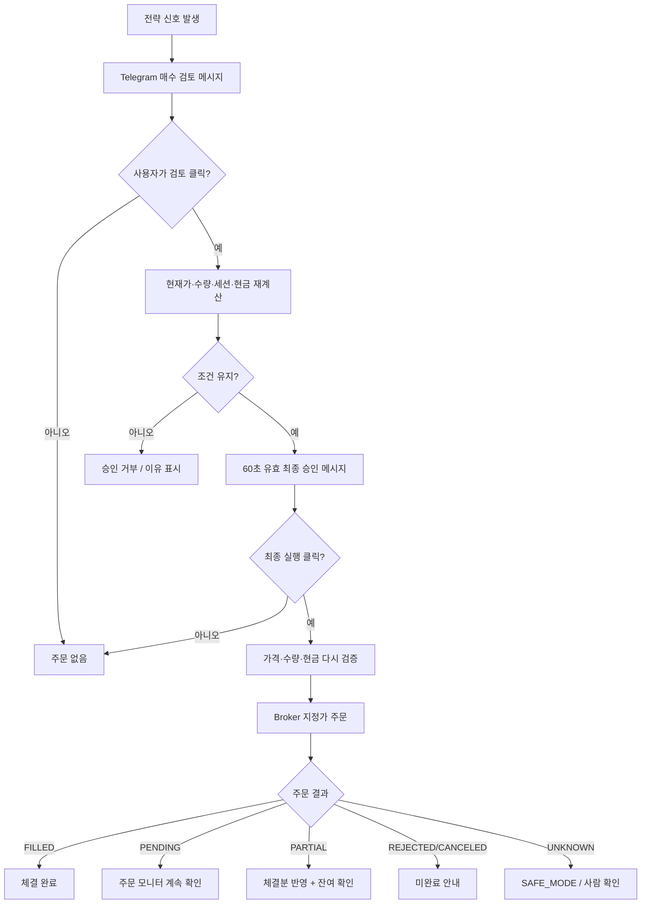

# JDSS V3.1 Telegram Bot 운영 가이드

Telegram 봇은 관리자 Chat ID 한 명만 허용한다. 현재 V3.1.0은 **dry-run 전용**이며 live는 잠겨 있다. 코어·부스터 매수는 `검토 → 최종 실행` 두 번의 버튼 승인이 필요하고, 추세 OFF나 목표 초과에 따른 코어 위험축소 매도만 자동 처리한다.

전략 자체를 처음 이해하려면 [`STRATEGY_GUIDE.md`](STRATEGY_GUIDE.md)를 먼저 읽는 것이 가장 쉽다.

## 1. 주요 명령

| 명령 | 설명 |
|---|---|
| `/ping`, `/p` | v3.1.0, dry-run, live 잠금 상태 |
| `/dashboard`, `/d` | JDSS 관리계좌·SGOV·종목별 코어와 부스터 통합 요약 |
| `/portfolio`, `/pf` | 6개월 월간 코어 추세·수량·JDSS 관리비중과 부스터 원가 |
| `/status [종목]`, `/s` | 코어 원장, 부스터 상태와 TP 목표 |
| `/score [종목]` | JDSS H40-S3 부스터의 최신 완결 일봉 점수 |
| `/history [종목] [1~90]` | 최근 부스터 점수 이력 |
| `/signal` | 현재 승인 가능한 코어·부스터 매수 신호 |
| `/sgov` | JDSS 관리 SGOV, 비관리 SGOV, 목표 유휴자금과 SAFE_MODE |
| `/bt` | V3.1 전체 포트폴리오 최근 300거래일 백테스트 |
| `/bt ALL 250` | V3.1 전체 포트폴리오 지정 거래일 백테스트 |
| `/bt TQQQ 100` | 단일 종목 JDSS 부스터 백테스트 |
| `/account` | Toss 미국주식 조회 전용 실제 계좌잔고 |
| `/order` | 현재 미체결 주문 |
| `/errors` | 최근 시스템 이벤트·오류·SAFE_MODE 원인 |
| `/guide` | V3.1 전략과 주요 안전규칙 카드 |

## 2. Telegram 매수 흐름

두 번 승인하는 이유는 신호가 만들어진 시점과 실제 주문버튼을 누른 시점의 가격이 다를 수 있기 때문이다.

## 3. 코어 매수 메시지 읽기

`월간 코어`는 QQQ 또는 SOXX의 완료 월말 종가가 6개월 이동평균 위인지 보여준다.

- 추세가 새로 ON: 대응 TQQQ·SOXL 목표 **10%**
- 다음 월말에도 ON: 목표 **15%**
- 추세 OFF: 목표 **0%**, 필요하면 자동 위험축소 매도

목표비중의 분모는 전체 Toss 계좌가 아니라 **JDSS managed equity**다.

코어 검토 버튼을 누르면 현재가를 다시 읽고 다음 두 수량을 비교한다.

1. 월말 신호를 만들었을 때 계산한 계획주수
2. 지금 가격·managed equity·현재 코어 보유량으로 다시 계산한 잔여 목표주수

**둘 중 작은 값만 최종 승인한다.** 따라서 신호 뒤 가격이 내려갔다고 계획보다 더 많이 사지 않고, 그 사이 코어가 일부 채워졌다면 중복매수도 하지 않는다.

### 코어 매수가 거절되거나 일부만 체결되면

- `REJECTED`, `CANCELED`이고 매수 신호 유효시간이 남아 있으면 → 동일 월말 신호를 **재승인 가능** 상태로 돌린다.
- 일부 체결 후 취소 → 체결된 수량은 코어 원장에 남기고 **잔여 목표만 다시 계산하여 승인**한다.
- 주문 결과가 `UNKNOWN` → 재주문하지 않고 **SAFE_MODE**로 전환한다. 중복매수를 막기 위해 사람이 확인해야 한다.

## 4. 부스터 메시지 읽기

`JDSS H40-S3 부스터`의 종목별 자금 상한은 `$8,000`이고, 현재 3단계 누적비중은 90%까지만 사용하므로 정상 한 사이클의 최대 신규투입은 `$7,200`이다.

- 1차: 누적 40%
- 2차: 최초 체결가 -2%, 누적 70%
- 3차: 최초 체결가 -5%, 누적 90%
- 총점 55점 이상
- 반등점수 5점 이상
- RED 국면 신규매수 차단
- SOXL은 SOXX·SMH EMA60 섹터 가드 적용

매수가 체결되면 자동 익절 주문을 관리한다.

- TP1: 평단 +4%, 약 30% 매도
- TP2: 평단 +10%, 나머지 매도
- 재매수 OFF
- 자동손절 OFF
- TP1 후 시간기준 잔량청산 OFF

## 5. 주문 전송 메시지의 상태별 의미

이제 단순히 “주문 전송 완료”라고만 표시하지 않고 실제 상태에 따라 의미를 나눈다.

| 표시 상태 | Telegram 의미 | 해야 할 일 |
|---|---|---|
| `FILLED` | 체결 완료 | 일반적으로 별도 조치 없음 |
| `PENDING` / `SUBMITTED` | 주문 접수, 아직 미체결 | `/order`로 진행 확인 |
| `PARTIAL_FILLED` | 일부만 체결 | 모니터가 잔여수량을 계속 확인 |
| `REJECTED` / `CANCELED` | 주문 미완료 | 코어 BUY면 `/signal` 재승인 여부 확인 |
| `UNKNOWN` | 브로커 결과를 확정할 수 없음 | `/errors`, `/order`, SAFE_MODE 확인 |

`UNKNOWN`을 성공으로 간주하지 않는 것이 가장 중요한 안전원칙이다.

## 6. SAFE_MODE가 뜨면

SAFE_MODE는 “에러가 났으니 프로그램이 고장났다”는 뜻이 아니라 **확실하지 않은 상태에서 새 돈을 더 넣지 않도록 잠근 상태**다.

대표 원인은 다음과 같다.

- Broker 수량과 SQLite 원장 수량이 다름
- DB에는 열린 주문이 있는데 Broker에서 찾을 수 없음
- 주문 결과가 UNKNOWN
- 코어 자동 위험축소 매도가 일부만 되고 종료됨
- JDSS 관리 SGOV 수량이 Broker에서 증명되지 않음
- 같은 계좌에 개인 TQQQ/SOXL이 섞여 Broker 합산수량과 JDSS 원장이 달라짐

종목 SAFE_MODE 또는 SGOV 자금 SAFE_MODE에서는 **기존 코어 신호를 포함해 신규매수를 승인·실행하지 않는다.**

확인 순서는 다음이 가장 쉽다.

1. `/errors` — 왜 SAFE_MODE가 됐는지 확인
2. `/order` — 열린 주문이 남았는지 확인
3. `/status TQQQ` 또는 `/status SOXL` — 내부 원장 확인
4. `/account` — 실제 Toss 조회잔고 비교

## 7. 시작 직후 정합성 오류

봇이 재시작될 때 Broker와 DB를 먼저 비교한다. 불일치가 있으면 로그에만 남기지 않고 Telegram으로 **`JDSS 시작 정합성 점검 실패`** 경고를 보낸다.

이때 봇 프로세스 자체는 실행될 수 있지만 문제 종목은 SAFE_MODE이고 신규매수는 차단된다.

## 8. 자동운영 중 오류 알림

스케줄러의 주요 작업은 서로 독립적으로 실행한다.

- 월간 코어 점검
- 일일 부스터 분석
- 주문·TP 모니터
- SGOV 주문 점검
- Reconciliation
- 신호 만료 정리

예를 들어 Yahoo 데이터 문제로 월간 코어 점검이 실패하더라도 주문 모니터와 Reconciliation까지 같이 멈추지 않는다.

중요한 자동운영 오류는 다음 세 군데에 남긴다.

- **서버 로그 파일**: traceback 포함 상세 기술기록
- **SQLite `event_logs`**: `/errors`에서 확인하는 운영기록
- **Telegram**: 즉시 알아야 할 오류 요약

같은 오류가 매 주기 반복되더라도 Telegram이 도배되지 않도록 **같은 오류 유형은 10분 동안 반복 알림을 억제**한다. DB와 파일 로그에는 각 발생이 계속 남는다.

## 9. `/errors` 읽는 방법

`/errors`는 최근 이벤트 10건을 보여준다. 중요한 예시는 다음과 같다.

| 이벤트 | 쉬운 의미 |
|---|---|
| `RECONCILIATION_FAILED` | 계좌와 내부원장이 다름. 신규매수 차단 |
| `SGOV_RECONCILIATION_FAILED` | JDSS SGOV 원장이 맞지 않음 |
| `CORE_BUY_INCOMPLETE` | 코어 매수가 전량 체결되지 않음 |
| `CORE_SELL_INCOMPLETE` | 코어 위험축소가 끝나지 않아 SAFE_MODE |
| `CORE_ORDER_SUBMISSION_UNKNOWN` | 코어 주문이 Broker에서 어떻게 됐는지 모름 |
| `ORDER_SUBMISSION_UNKNOWN` | 부스터 주문 결과 불명 |
| `PORTFOLIO_SCHEDULER_ERROR` | 월간 코어 자동점검에서 오류 발생 |
| `ANALYSIS_SCHEDULER_ERROR` | 일일 부스터 분석 오류 |
| `ORDER_MONITOR_ERROR` | 주문/TP 확인 루틴 오류 |
| `IDLE_CASH_*` | SGOV 관리 과정 오류 |

## 10. SGOV 메시지

전략 매수에 JDSS 관리현금이 부족하면 봇은 JDSS 관리 SGOV만 먼저 매도한다. 체결과 달러 주문가능금액이 확인되면 최신 주문조건을 다시 계산해 최종 승인 버튼을 전송한다.

개인 SGOV는 비관리 수량으로 표시하며 자동 매도하지 않는다. 개인 USD 현금도 JDSS 관리자금으로 자동 편입하지 않는다.

반면 **개인 TQQQ·SOXL을 JDSS와 같은 Toss 계좌에 함께 보유하는 방식은 지원하지 않는다.** 같은 종목은 Broker가 합산해서 보여주기 때문이다.

## 11. 백테스트 메시지를 해석할 때

`/bt` 전체 포트폴리오는 코어와 부스터가 현금을 공유하고 나머지를 SGOV로 운용하는 V3.1 production 전략 계산 결과다.

그러나 다음은 실제 운영과 정확히 같다고 볼 수 없다.

- 사용자가 승인버튼을 누르는 지연시간
- 실제 호가의 미체결·부분체결
- Broker/Yahoo API 일시 장애
- 서버가 주문 중간에 재시작되는 상황
- SGOV 현금화에 걸리는 시간

따라서 Telegram 백테스트 결과에는 **전략 계산은 production과 동일하지만 주문 장애는 운영 dry-run에서 별도 검증한다**는 의미가 포함된다. 자세한 성과와 재현근거는 [`BACKTEST_REPORT.md`](BACKTEST_REPORT.md)를 따른다.

## 12. 메시지 보안·표현 원칙

- 관리자 Chat ID 정확히 1명만 허용
- 버튼 callback도 관리자 본인인지 다시 확인
- 모든 출력은 Telegram HTML 사용
- 동적 값은 HTML escape
- 긴 백테스트 결과는 메시지 제한에 맞춰 분할
- `PENDING`, `REJECTED`, `UNKNOWN`을 모두 성공처럼 표현하지 않음
- 중요한 오류는 “무슨 일이 생겼는지 + 지금 거래가 차단됐는지 + 어디서 확인할지” 순서로 설명
